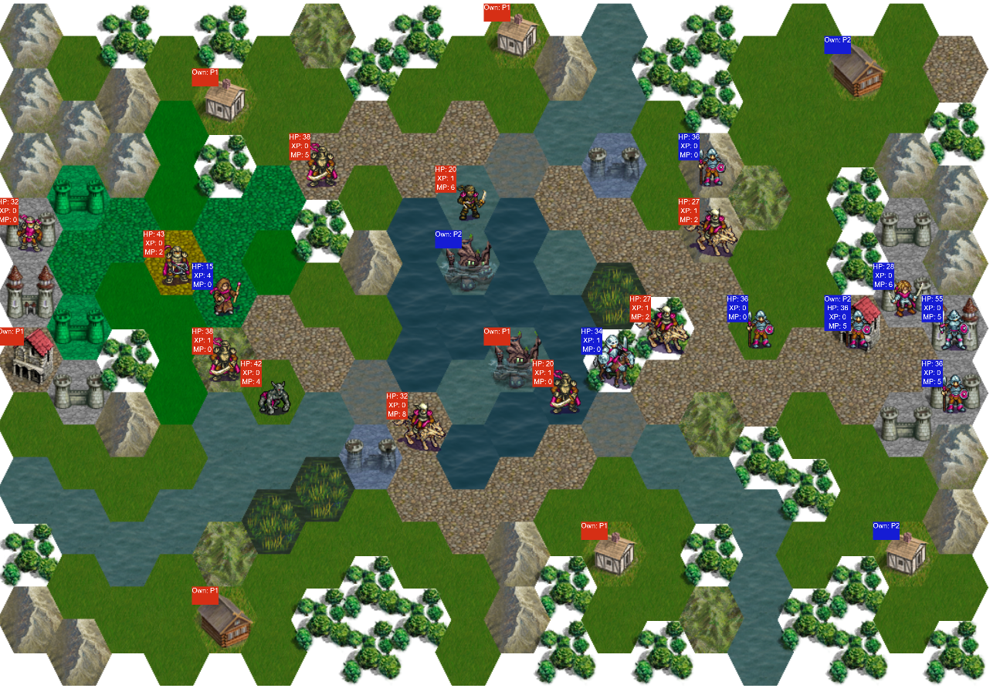

# AI player of TBS game based on cat swarm optimization

The game is implemented as TBS browser game, based on open-source project [Battle for Wesnoth](https://www.wesnoth.org/). AI players are driven by cat swarm optimization (CSO). The project is available at [Github](https://github.com/Neltharion59/PRIPROC_CSO_WESNOTH).

The project includes 4 separately executable parts:

- **Game:** The game itself is the part which most people will want to execute. It is wrapped in html page, so you need to open the html page. When the game is over, just refresh the browser to play again. There are two options of running the game:
>**Option 1:** Just run the *index.html* file in web browser. If the game appears distorted, try scrolling out and refreshing. It was not optimized to be displayed well on any browser and screen size, as it was not important part of the assignment.

>**Option 2:** You need to have local server running, the testing was performed using Apache server bundled in [Xampp](https://www.apachefriends.org/index.html). Xampp will create *htdocs* folder. You need to create a folder in it, for example *pripoc*. Then just place the entire content of this repository into this folder. You can display the page by running the server and navigating your web browser to [http://localhost/pripoc/index.html](http://localhost/pripoc/index.html).

- **Dictionary generation:** In repository, folder *python_scripts* contains configuration files of the original game (.cfg), python scripts that parse these files and produce javascript files (.py) and the most recently generated javascript files (.js). The generated javascript files act as configuration files for the game. Javascript executed in browser cannot access files, which is the reason why the game needs generated javascript files instead of original .cfg files. Executing these .py scripts makes sense when you modify them, resulting in generating javascript files with different content. Each .py script is for different .cfg file. This is very quick to execute.

- **Grid search:**  Similarly to **Game**, this is implemented as web page. Grid search executes games with all defined hyperparameter configurations of cat swarm optimization. This does not have graphical output. To execute this, follow instructions in **Option 2** in part **Game**. Running server is mandatory because REST API is used to write results of the grid search into file *train_log.txt* located in *api* folder of the project. Consider modifying the specified hyperparameters carefully, as current configuration takes about 8 hours to finish and requires manually increasing timeout limit of the browser.

- **Evaluation of grid search:** This is simple python script which reads the file generated by **Grid search** and evaluates the best models. It prints the results into screen. Running it requires having the specified log file in the same directory. This is very quick to execute.

# File structure
- *api* - folder related to evaluation of grid search
  - *train_log.txt* - file, to which results of grid search are continuosly appended
  - *write.php* - REST API php file, which writes received json into to *train_log.txt*.
 - *custom_scripts* - utility .js files used during game
   - *ajax_caller.js* - handy wrapper simplifying AJAX calls in code
   - *random_movement.js* - randomly selects from possible set of movements for units and performs consistency checks (so that 2 units don't move to same spot)
   - *unit_movements.js*  - calculates possible movements for all units using breadth-first search (BFS)
   - "util.js" - utility for creating empty 2D arrays
 - *data_files* - map-related data manipulation
   - *Map.js* - contains all maps used in game and related utility functions
   - *Terrain.js* - utility functions related to terrain
- *images* - all images used in game. They are taken from original game and [pixabay](https://pixabay.com/sk/)
- *lib* - used libraries
   - *Queue.js* - utility queue object with handy methods
   - *jquery-3.4.1.min.js* - JQuery library for easy manipation with DOM
   - *phaser.map* - Phaser library for rendering
   - *phaser.min.js* - Phaser library for rendering
- *python_scripts* - python scripts for converting .cfg files of original game to .js files with dictionaries with data from .cfg files. These .js files are used by the game
- *GameCore.js* - core mechanisms of the game. Other scripts invoke this to initiate and run the game
- *GridSearch.js* - performs grid search of hyperparameters for cat swarm optimization
- *cat_swarm_optimization.js* - performs cat swarm optimization
- *game.js* - runs the game with graphical output
- *index.html* - wraps the game into web page
- *index_grid_search.html* - wraps the grid search into web page